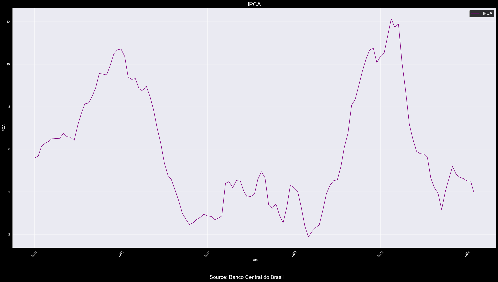
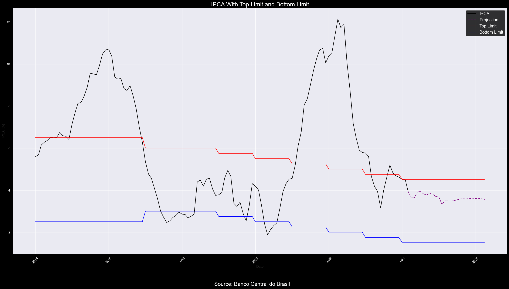
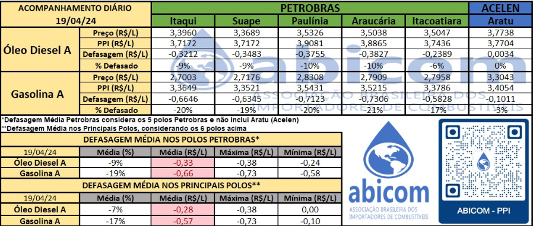
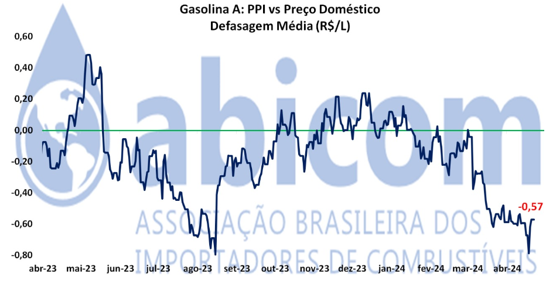

# 
Macro Research - Brazil

## 
Gabriel de Macedo Santos

## 
Macroeconomic Scenario <strong>Brazil</strong>

### Contact me: gabrieldemacedosantos03@gmail.com or gabriel.macedo@sou.inteli.edu.br

### Resumo - A incerteza no cenário mundial e local penaliza o Brasil
&emsp;&emsp;

### Inflação - Indice IPCA está decaindo, entretanto ainda é necessário ceticismo.

&emsp;&emsp;O Índice de Preços ao Consumidor Amplo (IPCA) tem demonstrado uma trajetória decrescente em suas últimas divulgações. O dado mais recente, referente ao mês de março, revelou um acréscimo de 0,16% m.m em relação ao mês anterior, contrastando com a expectativa mediana de 0,25% m.m. Este desempenho positivo surpreendeu favoravelmente o mercado, sugerindo uma tendência auspiciosa em curto prazo, evidenciada pela substancial redução na variação entre os meses de fevereiro, com 0,83% m.m, e março.

&emsp;&emsp;Além disso, é relevante destacar que o IPCA permanece dentro das projeções estipuladas pelo Banco Central, que delineiam os parâmetros para as decisões de política monetária no Brasil. Nesse contexto, o limite superior estabelecido é de 4,50% ao ano, enquanto o inferior é de 1,50% ao ano.

&emsp;&emsp;Entretanto, é necessário ponderar sobre os riscos ascendentes associados ao preço da gasolina no cenário interno, motivados pela defasagem entre os preços praticados internacionalmente e os domésticos. A defasagem média de preços da Gasolina A nos principais polos de distribuição da Petrobras é de -0,57 R$/L (-17%), contudo, essa média ainda não atinge o máximo registrado, que é de 0,73 R$/L. Ademais, ao considerar os polos da Petrobras como um todo, e não apenas os principais, observa-se uma situação ainda mais desafiadora, com a média dos preços praticados situando-se em -0,66 R$/L (-19%).

Fonte: Abicom

Fonte: Abicom

&emsp;&emsp;A atual defasagem de preços enfrentada pela Petrobras é um aspecto de relevância considerável no contexto econômico nacional. Esta discrepância entre os preços domésticos e internacionais da gasolina pode criar pressões inflacionárias adicionais, à medida que a empresa busca ajustar seus preços para refletir as condições globais do mercado. Tal ajuste poderia resultar em aumentos nos preços dos combustíveis, impactando diretamente os índices de inflação, como o IPCA.

&emsp;&emsp;Além disso, é crucial ressaltar que a volatilidade nos mercados internacionais de energia, exacerbada pelos conflitos no Oriente Médio e pelas tensões geopolíticas na Europa Oriental, adiciona uma camada de incerteza ao cenário. Esses fatores externos podem influenciar significativamente os preços do petróleo, afetando não apenas a Petrobras e os custos dos combustíveis no mercado interno, mas também a economia global como um todo.

&emsp;&emsp;Dessa forma, é imperativo monitorar de perto a evolução desses eventos e suas potenciais ramificações para a economia brasileira, especialmente no que diz respeito à inflação e à política monetária. A capacidade de resposta a esses desafios externos e internos será fundamental para manter a estabilidade econômica e assegurar um ambiente propício ao crescimento sustentável.