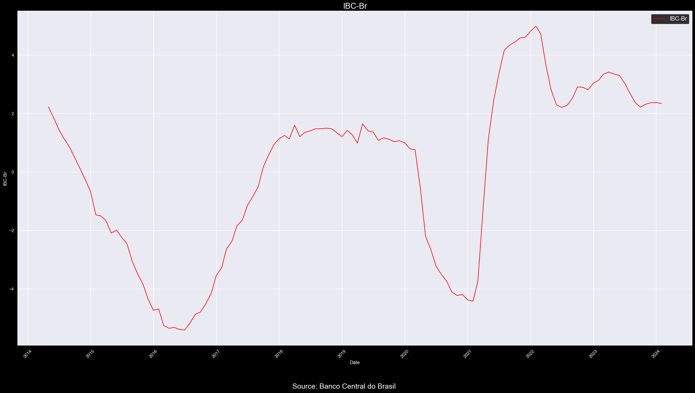
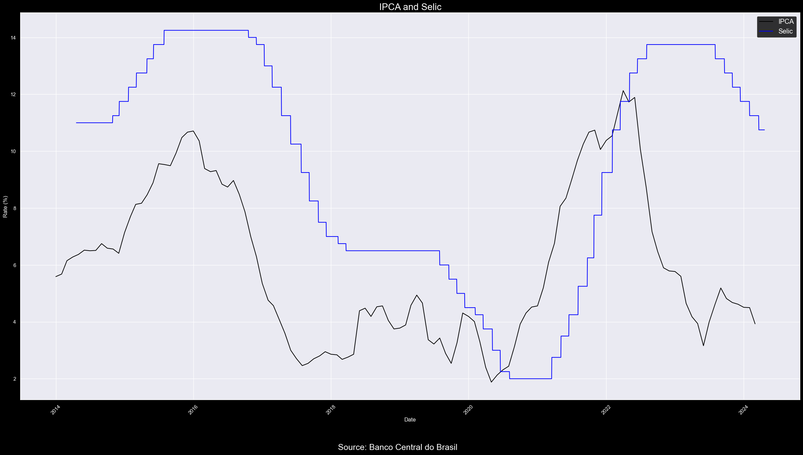

# 
Macro Research - Brazil

## 
Gabriel de Macedo Santos

## 
Macroeconomic Scenario <strong>Brazil</strong>

### Contact me: gabrieldemacedosantos03@gmail.com or gabriel.macedo@sou.inteli.edu.br

### Resumo - A incerteza no cenário mundial e local penaliza o Brasil

#### Inflação - Índice IPCA mostra tendência de queda, mas cautela é necessária.

O Índice de Preços ao Consumidor Amplo (IPCA) registrou uma trajetória decrescente nas últimas divulgações, com um acréscimo de 0,16% mês a mês em março, surpreendendo positivamente o mercado. Apesar disso, é preciso cautela, pois persistem riscos ascendentes relacionados ao preço da gasolina e à volatilidade nos mercados internacionais de energia, que podem afetar os índices de inflação no Brasil.

#### Câmbio - Moeda brasileira enfrenta desvalorização perante outras.

O dólar apresentou uma contínua escalada em relação ao real, influenciado por incertezas geopolíticas e expectativas sobre as políticas monetárias dos Estados Unidos. Além disso, o risco país brasileiro intensificou-se, refletindo desafios para a estabilidade econômica diante das projeções de déficit fiscal e da redução das metas de superávit.

#### IBC-Br - Crescimento em fevereiro indica melhora, mas desafios persistem.

O Índice de Atividade Econômica do Banco Central (IBC-Br) apresentou um incremento de 0,40% em fevereiro, alcançando o melhor resultado desde abril de 2023. Embora isso represente uma melhora, o cenário macroeconômico do Brasil permanece desafiador, com riscos relacionados à política monetária e à estabilidade fiscal.

#### Selic - Cenário externo incerto preocupa para nova queda de 50bp

Na última reunião do Comitê de Política Monetária (COPOM), houve uma mudança perceptível de postura em relação às próximas decisões de política monetária, com indicativos de uma disposição para adotar uma política ainda mais expansionista em relação à taxa SELIC. No entanto, é necessário cautela diante dos desafios internos e externos que podem impactar a economia brasileira, exigindo uma análise cuidadosa e uma abordagem prudente por parte do Banco Central.

### Inflação - Índice IPCA mostra tendência de queda, mas cautela é necessária.

&emsp;&emsp;O Índice de Preços ao Consumidor Amplo (IPCA) tem demonstrado uma trajetória decrescente em suas últimas divulgações. O dado mais recente, referente ao mês de março, revelou um acréscimo de 0,16% m.m em relação ao mês anterior, contrastando com a expectativa mediana de 0,25% m.m. Este desempenho positivo surpreendeu favoravelmente o mercado, sugerindo uma tendência auspiciosa em curto prazo, evidenciada pela substancial redução na variação entre os meses de fevereiro, com 0,83% m.m, e março.

&emsp;&emsp;Além disso, é relevante destacar que o IPCA permanece dentro das projeções estipuladas pelo Banco Central, que delineiam os parâmetros para as decisões de política monetária no Brasil. Nesse contexto, o limite superior estabelecido é de 4,50% ao ano, enquanto o inferior é de 1,50% ao ano.

&emsp;&emsp;Entretanto, é necessário ponderar sobre os riscos ascendentes associados ao preço da gasolina no cenário interno, motivados pela defasagem entre os preços praticados internacionalmente e os domésticos. A defasagem média de preços da Gasolina A nos principais polos de distribuição da Petrobras é de -0,57 R$/L (-17%), contudo, essa média ainda não atinge o máximo registrado, que é de 0,73 R$/L. Ademais, ao considerar os polos da Petrobras como um todo, e não apenas os principais, observa-se uma situação ainda mais desafiadora, com a média dos preços praticados situando-se em -0,66 R$/L (-19%).

Fonte: Abicom.

Fonte: Abicom.

&emsp;&emsp;A atual defasagem de preços enfrentada pela Petrobras é um aspecto de relevância considerável no contexto econômico nacional. Esta discrepância entre os preços domésticos e internacionais da gasolina pode criar pressões inflacionárias adicionais, à medida que a empresa busca ajustar seus preços para refletir as condições globais do mercado. Tal ajuste poderia resultar em aumentos nos preços dos combustíveis, impactando diretamente os índices de inflação, como o IPCA.

&emsp;&emsp;Além disso, é crucial ressaltar que a volatilidade nos mercados internacionais de energia, exacerbada pelos conflitos no Oriente Médio e pelas tensões geopolíticas na Europa Oriental, adiciona uma camada de incerteza ao cenário. Esses fatores externos podem influenciar significativamente os preços do petróleo, afetando não apenas a Petrobras e os custos dos combustíveis no mercado interno, mas também a economia global como um todo.

&emsp;&emsp;Dessa forma, é imperativo monitorar de perto a evolução desses eventos e suas potenciais ramificações para a economia brasileira, especialmente no que diz respeito à inflação e à política monetária. A capacidade de resposta a esses desafios externos e internos será fundamental para manter a estabilidade econômica e assegurar um ambiente propício ao crescimento sustentável.

### Câmbio - Moeda brasileira enfrenta desvalorização perante outras.

&emsp;&emsp;Na última sexta-feira (19/04/2024), o dólar encerrou cotado a R$5.2269, de acordo com dados fornecidos pelo Banco Central do Brasil. Esta cotação representa um aumento aproximado de 3% no período mensal.

&emsp;&emsp;Entretanto, mesmo nesse cenário de valorização da moeda estrangeira, é plausível antever uma contínua escalada do dólar devido ao atual contexto geopolítico. Persistem receios quanto aos desdobramentos nos conflitos no Oriente Médio, bem como às tensões em curso no Leste Europeu, com líderes políticos regionais emitindo ameaças constantes. Ademais, a expectativa de uma redução das taxas de juros nos Estados Unidos em próximas reuniões do Federal Reserve (FED) tem sido baixa devido a discursos mais rígidos proferidos por membros do conselho de politica monetária dos Estados Unidos.

&emsp;&emsp;Além disso, o risco país brasileiro (CDS 10y) intensificou-se na primeira quinzena de março, coincidindo com o início da valorização do dólar e de outras moedas em relação ao real. Vale ressaltar que a meta de déficit zero, inicialmente prevista para 2025, encontra-se abaixo do estabelecido no marco fiscal, que propunha um superávit de 0.5% do PIB. Em 2024, a tendência do atual governo é operar com uma margem de tolerância de 0.25 pontos percentuais para cima ou para baixo em relação ao PIB, com o superávit projetado apenas para 2026 (0.25% do PIB) e 2027 (0.5% do PIB).

&emsp;&emsp;Além disso, destaca-se o desempenho do real em relação às moedas de outros países emergentes. Infelizmente, a moeda brasileira registrou um desempenho desfavorável, sendo a que mais se desvalorizou em comparação com seus pares.

Fonte: Terminal Bloomberg.

&emsp;&emsp;O cenário macroeconômico atual do Brasil, marcado pela contínua desvalorização da moeda nacional perante outras moedas estrangeiras, reflete uma conjunção de fatores tanto internos quanto externos. A escalada do dólar, impulsionada por incertezas geopolíticas e expectativas relacionadas às políticas monetárias dos Estados Unidos, tem impactado significativamente a economia brasileira.

&emsp;&emsp;A intensificação do risco país, aliada às projeções de déficit fiscal e à redução das metas de superávit, sinalizam desafios substanciais para a estabilidade econômica do país nos próximos anos. Nesse contexto, é crucial que as autoridades governamentais adotem medidas eficazes para mitigar os efeitos negativos sobre o mercado cambial e promover uma gestão fiscal responsável.

&emsp;&emsp;O desempenho desfavorável do real em relação às moedas de outros países emergentes reforça a importância de uma análise abrangente e estratégica das políticas econômicas e das condições globais. O Brasil enfrenta, portanto, a necessidade premente de implementar políticas que fortaleçam sua posição no mercado internacional e impulsionem o crescimento econômico de forma sustentável e equilibrada.

### IBC-Br - Crescimento em fevereiro indica melhora, mas desafios persistem.

&emsp;&emsp;O Índice de Atividade Econômica do Banco Central (IBC-Br) apresentou um incremento de 0,40% em fevereiro, na série ajustada para efeitos sazonais. No mês anterior, o índice havia alcançado uma alta de 0,60% antes da revisão. Após os ajustes divulgados nesta quarta-feira (17) pelo Banco Central, a taxa foi revisada para 0,52%.

&emsp;&emsp;Assim, de janeiro a fevereiro, o índice de atividade calculado pelo BC elevou-se de 148,08 pontos para 148,67 pontos na série dessazonalizada. Este resultado representa o melhor desempenho desde abril de 2023, quando o indicador atingiu 148,88 pontos - o pico mais alto registrado na série histórica que teve início em janeiro de 2003.

&emsp;&emsp;Ademais, os dados do IBC-Br superaram ligeiramente a mediana das expectativas do mercado financeiro, coletadas pelo Projeções Broadcast, que apontavam um avanço de 0,30% no indicador para o mês. De forma geral, as projeções variavam de uma queda de 0,60% a um crescimento de 1,00%.

&emsp;&emsp;Na comparação entre fevereiro de 2024 e o mesmo mês de 2023, observou-se um aumento de 2,59% na série sem ajustes sazonais. Este período registrou 144,61 pontos em fevereiro, o melhor desempenho para este mês na série histórica do BC iniciada em 2003.

&emsp;&emsp;O índice de fevereiro em relação ao mesmo mês de 2023 ficou acima da mediana do avanço de 2,34% apontada pela pesquisa do Projeções Broadcast. As expectativas coletadas variavam de estabilidade a um incremento de 4,00%.

#### IBC-Br com a Selic
&emsp;&emsp;Ademais, a correlação entre o Índice de Atividade Econômica do Banco Central (IBC-Br) e a Taxa Selic é uma análise fundamental para compreender a dinâmica da economia brasileira. Normalmente, existe uma relação inversa entre esses dois indicadores: quando a Selic (taxa básica de juros) sobe, o IBC-Br tende a cair, e vice-versa. Isso ocorre devido aos efeitos das decisões de política monetária sobre o comportamento dos agentes econômicos e, consequentemente, sobre a atividade econômica.

&emsp;&emsp;Durante o período da pandemia, essa relação pode ter sido influenciada por diversos fatores extraordinários, como medidas de estímulo econômico, intervenções governamentais, efeitos do distanciamento social e incertezas nos mercados financeiros. Porém, agora, com a queda relativamente da Selic e a estabilização do IBC-Br, é possível observar uma mudança nessa dinâmica.

&emsp;&emsp;A redução da Taxa Selic tende a estimular o consumo e os investimentos, impulsionando a atividade econômica. Contudo, se o IBC-Br permanece lateralizado apesar da queda da Selic, isso pode indicar que outros fatores estão influenciando a atividade econômica de forma contrária, como incertezas políticas, instabilidade externa, desequilíbrios fiscais ou estruturais, entre outros.

### Selic - Cenário externo incerto preocupa para nova queda de 50bp.

&emsp;&emsp;Na recente reunião do Comitê de Política Monetária (COPOM), realizada em um contexto global permeado por incertezas geopolíticas e econômicas, observou-se uma significativa alteração de postura em relação às próximas decisões de política monetária. Embora o mercado já estivesse precificando uma redução no Índice Nacional de Preços ao Consumidor Amplo (IPCA), indicando uma tendência de desaceleração da inflação, as deliberações no COPOM sugeriram uma predisposição para adotar uma política ainda mais expansionista em relação à taxa SELIC.

&emsp;&emsp;A análise da próxima reunião do COPOM exige não apenas uma consideração dos dados do IPCA, que evidenciam essa tendência de queda, mas também uma avaliação abrangente de diversas perspectivas macroeconômicas. Torna-se relevante observar o comportamento atual do Federal Reserve (FED) em relação à Federal Funds Rate (FFR), que não mais sinaliza um cenário propício para uma redução acentuada nas próximas reuniões. Assim como o COPOM demonstrou habilidade para elevar as taxas de juros a níveis significativos, há uma certa cautela em reduzi-las em um momento menos favorável.

&emsp;&emsp;As recentes manifestações de membros do governo em favor de uma redução significativa das taxas de juros são acompanhadas de perto pelo Banco Central, que mantém uma postura cautelosa diante de possíveis mudanças na política monetária. Embora o estímulo ao crédito com taxas mais baixas possa impulsionar o consumo e o investimento, há preocupações quanto aos impactos de uma abordagem excessivamente expansionista.

&emsp;&emsp;O Banco Central tem o compromisso de manter a estabilidade econômica e controlar a inflação dentro de limites aceitáveis, o que requer uma análise minuciosa dos diferentes fatores que influenciam a economia. Diante de um cenário global marcado por incertezas e volatilidade, é fundamental que as decisões de política monetária sejam tomadas com prudência e considerando os riscos potenciais.

&emsp;&emsp;A implementação de medidas de estímulo pode ter efeitos positivos de curto prazo, mas é importante avaliar também suas consequências a médio e longo prazo. Um afrouxamento excessivo da política monetária pode gerar pressões inflacionárias e instabilidade financeira, comprometendo a sustentabilidade do crescimento econômico no longo prazo.

&emsp;&emsp;Após as últimas declarações do COPOM, o boletim Focus revisou sua previsão para a taxa SELIC no final de 2024, ajustando-a de 9% a.a. para 9.13% a.a. Essa mudança de perspectiva reflete o atual receio do Banco Central em reduzir as taxas de juros em meio a uma complexidade interna, que envolve questões políticas e fiscais, e externa, marcada por incertezas geopolíticas e econômicas.